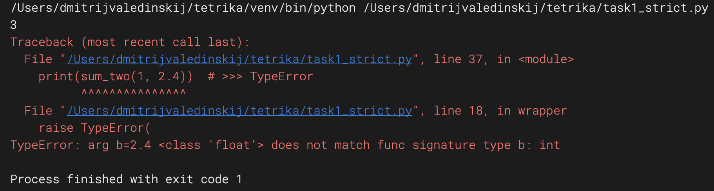
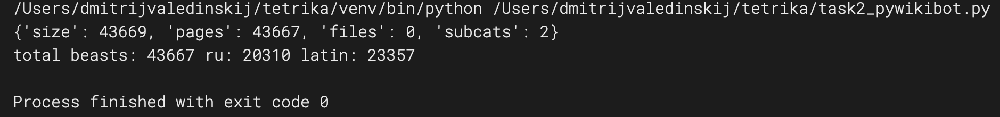
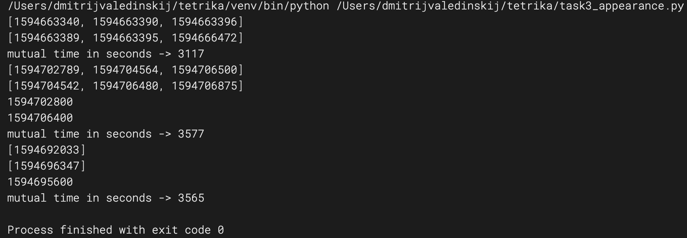

###  тестовое задание: https://github.com/CaerDarrow/juniors_interview/tree/main

- декоратор @strict:

Проверяет соответствие переданных аргументов функции параметрам сигнатуры функции.

- Животные_по_алфавиту: wikipedia.ru

Прямой рекурсивный парсинг данных wikipedia для меня пока сложен.
Приведен пример простого парсинга заглавной таблицы "Животные_по_алфавиту": outputs/presentation.csv.
Для решения задачи использован pywikibot.
Приложение получает список всех животных, подсчитывает их кол-во по категориям (заглавным буквам алфавита),
выделяет русскоязычные и латинские названия. Результат записывается в outputs/beasts.csv.

- Общее присутствие:

Простое на первый взгляд задание осложнено наличием пересекающихся временных интервалов во входных данных,
что, вероятно, может быть результатом использования пользователем нескольких устройств для доступа к уроку.
Приложенный тест успешно пройден.

